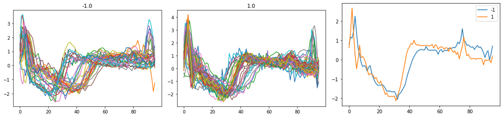
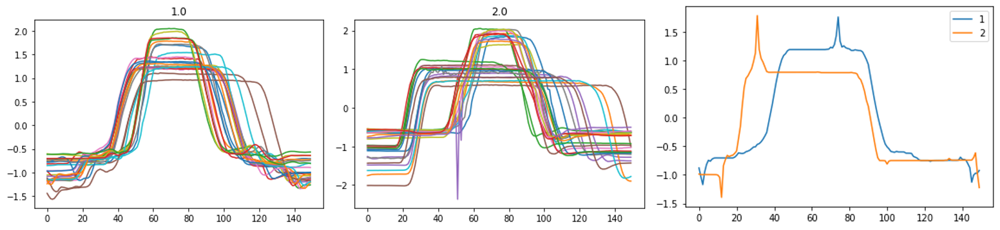

# Time Series Mining Final Project

This project is the final project of 2110430 Time Series Mining and Knowledge Discovery in Semester 2/2020 Computer Engineering of Chulalongkorn University

The project is seperated in 2 parts below.

## Part I: Optimal weight for DTW distance calculation

This part is to experiment the modified DTW distance calculation between two time series sequences, regarding to Sakoe and Chiba (1978)'s paper: Dynamic programming algorithm optimization for spoken word recognition (DOI: [10.1109/TASSP.1978.1163055](https://doi.org/10.1109/TASSP.1978.1163055)).

In classification tasks in the dataset, we will classify the time series datasets into many classes, by considering the distance between the sequences. Thus, before making classification tasks, we have to complete the distance tasks.

The easiest way to calculate how far between two time series sequences is finding the difference at each pair of the data points from two time series sequences. This method is called Euclidean distance.

\
*Euclidean distance\
Credit: GUNA, J. et al. (DOI: [10.1007/s11042-013-1635-1](https://doi.org/10.1007/s11042-013-1635-1))*

However, in many cases, e.g. spoken words (from Sakoe and Chiba (1978)'s paper), the euclidean method will give the inaccurate distance, because this type of time series sequences usually gave the distort shape, so that Euclidean distance might gave the bad results. 

From the picture below, we have to match between peak to peak, this will make sense more than the Euclidean method.

One of the accurate way of distance tasks is DTW algorithm. To briefly explain about the algorithm, the DTW algorithm is the distance function for calculating how far between two time series sequences by matching the points that will give the smallest distance.

\
*Dynamic Time Warping (DTW)\
Credit: [Programminglinguist on Wikipedia](https://commons.wikimedia.org/wiki/File:Dynamic_time_warping.png)*

The algorithm that use to match the points is using dynamic programming to find the minimum of considering the previous points that contain cumulative distance. The previous points are left (i - 1, j), bottom (i, j - 1), and bottom-left (i - 1, j - 1) when current point is (i, j) from the filled distance matrix between two time series sequences. The path that generated from matches data points called warping path.

\
*The three previous neighboring cells*

\
*DTW Distance and Warping Path\
Credit: Li Y, Liu RW, Liu Z, Liu J. (DOI: [10.1109/ACCESS.2019.2920436](https://doi.org/10.1109/ACCESS.2019.2920436))*

In Sakoe and Chiba (1978)'s paper, they do the research about Spoken-word recognition and proposed the DP-matching principle, the pattern-matching algorithm based on dynamic programming. This algorithm will let the time axis (X-axis) fluctate by using a non-linear time-warping function (modified from DTW algorithm), so that we can ignore the length of the time series sequences that might be difference. 

Nevertheless, the non-linear time-warping function have the topic to consider that are

1. We have to add weighting coefficient when consider the minimum cost of previous points, in the symmatric form and the asymmetric form\
\
\
*Weighting Coefficient\
Credit: Sakoe H, Chiba S. (DOI: [10.1109/TASSP.1978.1163055](https://doi.org/10.1109/TASSP.1978.1163055))*\
\
Then, what are the weights that will let the best results for the classification tasks, in term of accurary?\
We will take the experiment in Part I.A

2. In this paper, they proposed the DP-algorithm. We have to consider more than the 3 neighboring cells in the minimum-finding candidates.\
\
\
\
*Symmetric and Asymmetric DP-algorithms with Slope Constraint Condition P = 0, 1/2, 1, and 2\
From this table, P is the slope constraint of the warping function, that equal to n/m when m is maximum consecutive steps in i-axis (or j-axis), and n is the steps in diagonal line.\
Credit: Sakoe H, Chiba S. (DOI: [10.1109/TASSP.1978.1163055](https://doi.org/10.1109/TASSP.1978.1163055))*\
\
Then, instead of considering only the 3 neighbouring cells, left, bottom, and bottom-left, is it will have the improved results, in term of accuracy?\
We will take the experiment in Part I.B

The implemented python codes ```dtw.py``` and ```dtw_P.py``` modified from ```dtw.py``` in [eug/dynamic-time-warping](https://github.com/eug/dynamic-time-warping) 

Our experiment is on the ECG200 datasets, that are attached in this repo.

\
*ECG200 Train and Test dataset*

We seperated the test into 2 parts.

### Part I.A: Weighting Coefficient  

In this part, we make an experiment by modifying the weights of the three neighboring cells from 0 to 3 to find that what is the optimal values of the weights that make the accuracy better.

The implemented python code is at [dtw.py](dtw.py).

We have the 64 combinations of the weighting coefficients. The full table is available at [1A_result.csv](1A_results.csv)

\
*The accuracy when change the weighting coefficients*

The summary is, we can't find the optimal values of the weights, but we can find that the weight that have the most significantly effect to the classification accuracy is the bottom-left weight.

### I.B: Considering other cells

In this part, we considered other cells instead of the three neighboring cells and find out the effect on the classification accuracy.

The implemented python code is at [dtw_P.py](dtw_P.py).

\
\
*The accuracy when change P in the symmetric and asymmetric forms*

As you can see in the of the symmetric form graph, the more P doesn’t mean that the accuracy will be more higher, at P is 1 let the accuracy higher than P is 2,
Also, from the symmetric form graph, the best accuracy is at P is 0.5.

From the result, we must set an appropriate P to get the best accuracy, because the larger of P is the more restricted of function. In the other hand, if P is too low, the function is more lax then the discrimination not work well.

## Part II: Shape averaging method

The part is about shape averaging method of multiple time series sequences.

In averaging method of multiple time series sequences, if we average point-to-point on the time series sequences, we might get the misunderstanding results, as the picture below. This method can call arithmetic mean.

\
*Arithmetic mean of time series sequences\
Credit: François Petitjean from [DBA](https://github.com/fpetitjean/DBA))*

To make the average of time series sequences, we might take average to keep the shape of the original time series sequences. The method that using in this project called "DTA: Dynamic Time Warping Barycenter Averaging".

\
*DBA of time series sequences\
Credit: François Petitjean from [DBA](https://github.com/fpetitjean/DBA))*

The implemented python code is at [dba.py](dba.py), modified from [fpetitjean/DBA](https://github.com/fpetitjean/DBA) based on the papers below.
* [Pattern Recognition 2011](http://francois-petitjean.com/Research/Petitjean2011-PR.pdf): A global averaging method for Dynamic Time Warping 
(DOI: [10.1016/j.patcog.2010.09.013](https://doi.org/10.1016/j.patcog.2010.09.013))
* [ICDM 2014](http://francois-petitjean.com/Research/Petitjean2014-ICDM-DTW.pdf): Dynamic Time Warping Averaging of Time Series allows Faster and more Accurate Classification
(DOI: [10.1109/ICDM.2014.27](https://doi.org/10.1109/ICDM.2014.27))
* [ICDM 2017](http://francois-petitjean.com/Research/ForestierPetitjean2017-ICDM.pdf): Generating synthetic time series to augment sparse datasets
(DOI: [10.1109/ICDM.2017.106](https://doi.org/10.1109/ICDM.2017.106))

This technique begin with finding the approximate **medoid**, the sequence that is the representative of all time series sequences, by calculating the sum of DTW between other sequences. If the datasets is huge, we will randomly select 50 candidates to find the medoid.

When **medoid** is found, we will calculate the average between medoid to each time series sequences in the datasets. First is between medoid and first sequence. Then, between the previous results to the next time series sequence. In this calculation, we will apply the DTW method. We will repeat the averaging calculation to 10 times.

In this part, we have experimented on ECG200 and Gun VS Point datasets. Before starting the DBA, we seperated the dataset into specifed classes.

This is the results from DBA technique.

\
*ECG200 Shape Averaging*

\
*Gun VS Point Shape Averaging*

## Members
1. Kongtap Arunlakvilart 6030033321
2. Kantorn Chitchuen 6030038521
3. Yanika Dontong 6031010021
